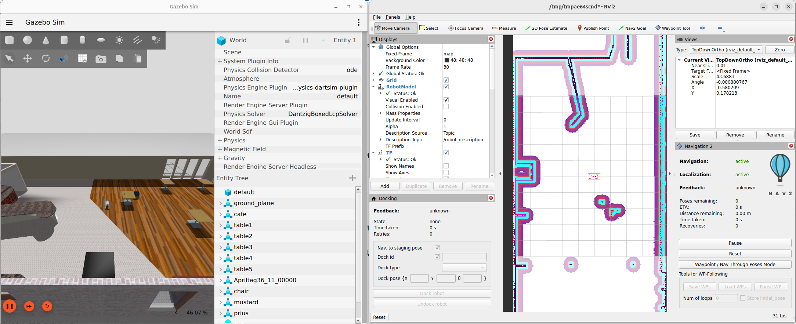
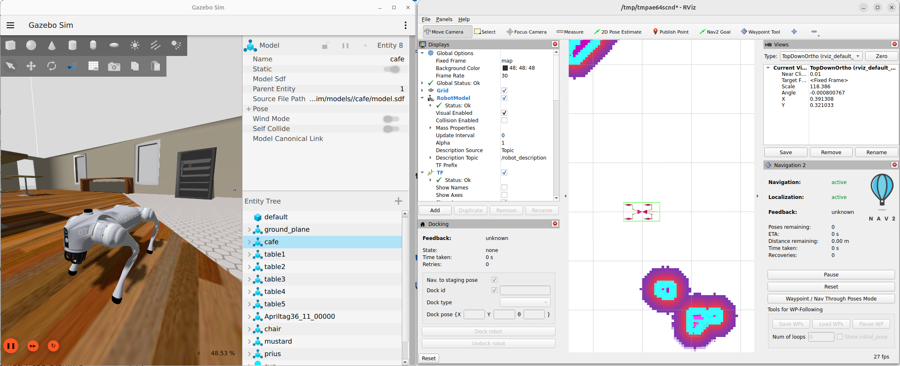

# Методические указания к лабораторным работам по ROS 2


## Общая цель работы

Изучить фреймворк ROS 2 на примере автономной навигации мобильного робота в симуляции Gazebo с использованием Nav2 и детекции объектов YOLO.

---

## Работа №0: Установка, сборка и изучение проекта

### Цель

Установить программное обеспечение, собрать проект в Docker-контейнере, изучить структуру ROS 2 пакетов, запустить симуляцию для ознакомления.

### Теоретическая часть

**ROS 2 (Robot Operating System 2)** — фреймворк для разработки робототехнических систем. Ключевые понятия:

- **Node** — минимальная единица исполнения. Каждый узел отвечает за одну задачу.
- **Topic** — канал публикации/подписки для асинхронного обмена данными (publisher/subscriber).
- **Service** — синхронный запрос-ответ (client/server).
- **Action** — асинхронный запрос с обратной связью (action client/action server).
- **Package** — единица распространения кода в ROS 2. Содержит узлы, сообщения, сервисы, конфиги.
- **Launch file** — файл для запуска нескольких узлов одновременно.
- **Workspace** — директория, содержащая исходные коды пакетов, собранные бинарные файлы и скрипты установки.

**ROS 2 Graph**:

Каждая ROS 2 система представляет собой граф, где узлы (nodes) общаются через топики (topics), сервисы (services) и действия (actions). Граф можно исследовать с помощью команд `ros2 node`, `ros2 topic`, `ros2 service`, `ros2 action`.

**Docker** — система контейнеризации. Весь проект работает внутри Docker-контейнера, который содержит ROS 2 Jazzy, Gazebo, Nav2, YOLO и все зависимости. Контейнер изолирует окружение и гарантирует одинаковую работу на любой Linux-системе.

**colcon** — стандартная система сборки ROS 2 проектов внутри контейнера.

**Gazebo Sim** — симулятор физики с поддержкой ROS 2 через пакет `ros_gz_bridge`.

### Программное обеспечение (на хосте)

- Любой дистрибутив Linux (Ubuntu, Fedora, Arch и т.д.)
- Git
- Docker Engine 24+ и Docker Compose
- X-Server для отображения GUI (Gazebo, RViz)

### Исходный код

Репозиторий: `WalkingRobotSim`

Основные пакеты проекта:

| Пакет                       | Назначение                                           |
| --------------------------- | ---------------------------------------------------- |
| `gazebo_sim`                | Launch-файлы, конфигурации Nav2, EKF, waypoint-файлы |
| `quadropted_msgs`           | Пользовательские сообщения и сервисы                 |
| `quadropted_controller_cpp` | Контроллер походки робота на C++                     |
| `quadropted_controller`     | Контроллер походки робота на Python                  |
| `quadropted_perception`     | YOLO детектор и визуализатор                         |
| `rviz_waypoint_tool`        | Плагин RViz для установки путевых точек              |
| `go2_description`           | URDF-описание робота Unitree Go2                     |
| `tests`                     | Интеграционные тесты и бенчмарки                     |

---

### Ход работы

#### Шаг 1. Установка Docker на хосте

Если Docker ещё не установлен — следуйте официальной инструкции:

```bash
# Откройте https://docs.docker.com/engine/install/ubuntu/
# и выполните шаги по установке Docker Engine и Docker Compose.
```

После установки добавьте пользователя в группу `docker` (чтобы не использовать `sudo`):

```bash
sudo usermod -aG docker $USER
# Выйдите и зайдите заново (или выполните: newgrp docker)
```

Проверьте установку:

```bash
docker --version
docker compose version
```

#### Шаг 2. Клонирование репозитория

```bash
git clone https://github.com/RedAlexDad/WalkingRobotSim.git
cd WalkingRobotSim
```

#### Шаг 3. Изучение Docker-инфраструктуры проекта

Изучите файлы Docker:

```bash
ls src/docker/
cat src/docker/Dockerfile         # многоступенчатая сборка (6 стадий)
cat src/docker/compose.yml        # сервисы, volumes, network
```

Dockerfile состоит из стадий:

1. `base-system` — системные пакеты
2. `ros-core` — ROS 2 Jazzy
3. `ros-control`, `ros-simulation`, `ros-navigation`, `ros-vision`, `ros-tools` — слои зависимостей
4. `workspace` — сборка colcon
5. `final` — финальный образ

#### Шаг 4. Сборка и запуск Docker-образа

Рекомендуется запустить сборку и запуск контейнера одной командой:

```bash
make deploy
```

`make deploy` выполнит последовательно `make build` (сборка образа) и `make up` (запуск контейнера).

Сборка занимает 10-30 минут, ~12 GB.

Если нужно только пересобрать образ без запуска:

```bash
make build
```

После сборки проверьте:

```bash
docker images | grep walking_robot_sim
```

#### Шаг 5. Подключение к контейнеру

Подключитесь к терминалу контейнера:

```bash
make shell
```

Внутри контейнера вы увидите приглашение:

```
root@hostname:~/ws#
```

Все команды ROS 2 далее выполняются **внутри контейнера**.

#### Шаг 6. Изучение структуры проекта (внутри контейнера)

Внутри контейнера:

```bash
# Посмотреть структуру workspace
ls -la ~/ws/src/

# Посмотреть список ROS 2 пакетов
ros2 pkg list | grep -E "quadropted|gazebo|go"

# Изучить пользовательские сообщения
ros2 interface show quadropted_msgs/msg/Waypoint
ros2 interface show quadropted_msgs/msg/Detection
ros2 interface show quadropted_msgs/msg/DetectionArray
ros2 interface show quadropted_msgs/srv/LoadWaypoints
ros2 interface show quadropted_msgs/srv/GetWaypoints
ros2 interface show quadropted_msgs/srv/WaypointNavigate

# Изучить доступные make-цели (вне контейнера, на хосте)
# Выйдите из контейнера (Ctrl+D) и выполните на хосте:
make help

# Затем вернитесь в контейнер:
make shell
```

Запишите:

- Какие пакеты входят в проект
- Структуру каждого сообщения и сервиса
- Какие make-цели доступны

#### Шаг 7. Сборка внутри контейнера (если нужно пересобрать)

Внутри контейнера:

```bash
cd ~/ws
colcon build --symlink-install
source install/setup.bash
```

#### Шаг 8. Запуск симуляции

Запуск симуляции производится **на хосте** (чтобы Gazebo и RViz отображались на экране):

```bash
make gazebo-cpp
```

После запуска:

- Откроется Gazebo с миром `cafe.world` и роботом Unitree Go2.
- Откроется RViz с картой, лазерным сканом, одометрией.

Дождитесь полной загрузки (30-60 секунд). Не закрывайте это окно.





> **Примечание:** Если робот перевернулся и лежит на спине, а ноги сильно вытянуты — перезапустите симуляцию (Ctrl+C, затем снова `make gazebo-cpp`).

#### Шаг 9. Исследование запущенной системы

Откройте **новый терминал на хосте** и подключитесь к контейнеру:

```bash
cd WalkingRobotSim
make shell
```

Внутри контейнера выполните:

```bash
# Список активных узлов
ros2 node list

# Список топиков
ros2 topic list

# Список сервисов
ros2 service list

# Список действий
ros2 action list

# Частота публикации одометрии
ros2 topic hz /robot1/odom

# Информация о графе
rqt_graph
```

Изучите вывод. Запишите:

- Какие узлы запущены
- Какие топики публикуются
- Какие сервисы доступны
- Почему все топики имеют префикс `/robot1/`

#### Шаг 10. Визуализация в RViz

Изучите окно RViz (на хосте). В левой панели показаны дисплеи:

- `Map` — карта мира
- `RobotModel` — модель робота
- `LaserScan` — лазерный скан
- `PoseArray` — частицы локализации (AMCL)
- `Path` — глобальный и локальный путь

Попробуйте добавить новый дисплей: `Add` → выберите `TF`. Посмотрите, как выглядит дерево трансформаций.

#### Шаг 11. Визуальное перемещение робота

> **Важно:** Этот шаг выполнять только если одометрия или облако частиц (PoseArray) сбились — робот отображается не в том месте карты.
> В штатном режиме локализация работает автоматически.

В RViz на панели инструментов найдите `2D Pose Estimate`:

1. Кликните по карте в точке, где робот находится на самом деле.
2. Потяните стрелку, чтобы указать направление (совпадает с направлением робота в симуляции).
3. Облако частиц (PoseArray) перестроится — локализация восстановлена.

Найдите `Nav2 Goal`:

1. Кликните по карте — задайте цель для навигации.
2. Наблюдайте, как робот строит путь и двигается к цели.

#### Шаг 12. Остановка симуляции

В терминале с симуляцией нажмите `Ctrl+C`.

Или на хосте:

```bash
make down
```

### Результат работы №0

После выполнения вы должны уметь:

- Клонировать репозиторий и собрать Docker-образ
- Запускать контейнер и подключаться к нему (`make up`, `make shell`)
- Запускать и останавливать симуляцию (`make gazebo-cpp`, `make down`)
- Исследовать граф ROS 2 (узлы, топики, сервисы, действия)
- Использовать RViz для визуализации
- Задавать цели навигации вручную
