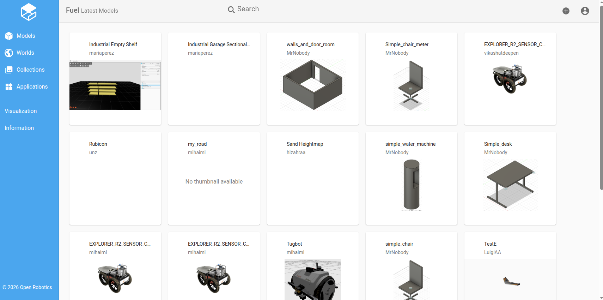
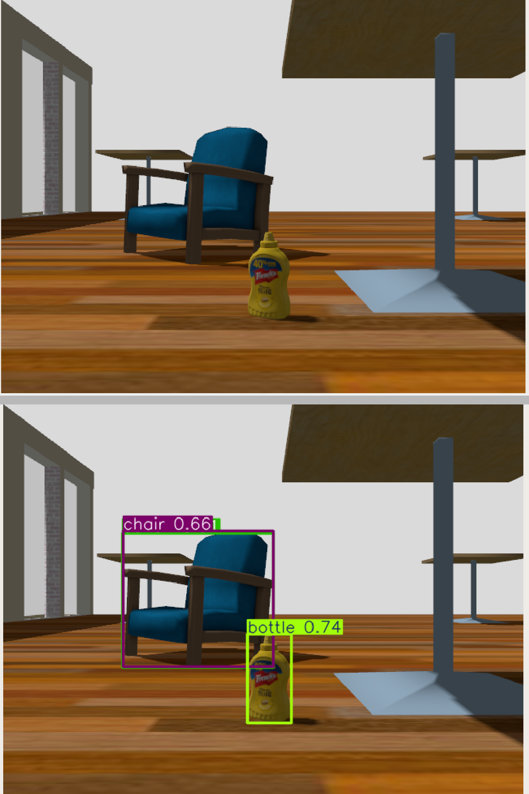

# Лабораторная работа №2: Детекция объектов YOLO


## Цель

Изучить детекцию объектов с помощью YOLO, сравнить точность и производительность разных моделей семейства YOLOv8, настроить параметры детекции.

## Теоретическая часть

**YOLO (You Only Look Once)** — алгоритм детекции объектов в реальном времени. Использует нейросеть для одновременного определения местоположения и класса объектов на изображении.

**Модели YOLOv8:**

| Модель       | Параметров | Размер (MB) | Точность (mAP) |
| ------------ | ---------- | ----------- | -------------- |
| `yolov8n.pt` | 3.2M       | 6.3         | 37.3           |
| `yolov8s.pt` | 11.2M      | 22.5        | 44.9           |
| `yolov8m.pt` | 25.9M      | 52.0        | 50.2           |
| `yolov8l.pt` | 43.7M      | 87.6        | 52.9           |

**COCO (Common Objects in Context)** — датасет из 80 классов объектов (person, car, chair и т.д.), на котором обучены модели YOLOv8.

**Пакеты для работы с YOLO в проекте:**

- `quadropted_perception` — пакет, содержащий:
  - `yolo_detector.py` — узел для детекции объектов на изображении с камеры робота
  - `visualizer.py` — узел для визуализации детекций в RViz (маркеры)
- `quadropted_msgs` — содержит сообщения:
  - `Detection.msg` — информация об одном обнаруженном объекте (класс, уверенность, bounding box)
  - `DetectionArray.msg` — массив детекций за один кадр

**Периодическое логгирование:**

YOLO детектор поддерживает запись результатов детекции в CSV-файл с заданным интервалом (10, 20, 30 секунд). Параметры:

- `log_interval_sec` — интервал записи (0 = отключено)
- `log_file` — путь к файлу лога

Если объекты не обнаружены — в лог пишется `no detections` (без `class_id`, `class_name`, `confidence`).

## Ход работы

### Шаг 1. Изучение пакета perception

Подключитесь к контейнеру (`make shell`) и изучите структуру пакета `quadropted_perception`:

```bash
find ~/ws/src/quadropted_perception -type f -name "*.py" -o -name "*.yaml" -o -name "*.launch.py"
```

Изучите файлы:

- `yolo_detector.py` — основной узел детекции
- `visualizer.py` — визуализация маркеров
- `config/yolo_detector.yaml` — параметры конфигурации
- `launch/yolo_detector.launch.py` — launch-файл

### Шаг 2. Изучение сообщений детекции

Внутри контейнера (`make shell`):

```bash
ros2 interface show quadropted_msgs/msg/Detection
ros2 interface show quadropted_msgs/msg/DetectionArray
```

Запишите, какие поля содержит каждое сообщение.

### Шаг 3. Запуск симуляции

Запустите на **хосте** симуляцию:

```bash
cd WalkingRobotSim
make gazebo-cpp
```

Дождитесь полной загрузки (30-60 секунд).

### Шаг 4. Запуск YOLO детектора

На хосте откройте второй терминал и запустите YOLO:

```bash
cd WalkingRobotSim
make yolo-detector
```

**Примечание**: При первом запуске модель `yolov8n.pt` будет автоматически скачана (размер ~6 MB).

Для запуска с другой моделью используйте параметр `MODEL`:

```bash
make yolo-detector MODEL=yolov8s
make yolo-detector MODEL=yolov8m
make yolo-detector MODEL=yolov8l
```

**Своя предобученная модель**: поместите файл `.pt` в директорию `src/quadropted_perception/models/` (создайте, если нет) и укажите имя без расширения:

```bash
# Например, для файла src/quadropted_perception/models/my_custom.pt
make yolo-detector MODEL=my_custom
```

### Шаг 5. Проверка работы детекции

Проверьте топики:

```bash
ros2 topic list | grep -E "detection|Detected"
```

Вы должны увидеть:

- `/detections` — массив детекций (DetectionArray)
- `/detected_image` — изображение с нарисованными боксами (Image)
- `/detection_markers` — маркеры для RViz (MarkerArray)

Посмотрите содержимое детекций:

```bash
ros2 topic echo /detections
```

Обратите внимание на классы и количество обнаруженных объектов для каждой модели.

Для проверки детекции поднесите объект к камере робота в Gazebo (передвиньте объект через меню Gazebo: `Left click` → `Move`).



Дополнительные 3D-модели: [Gazebo Fuel](https://app.gazebosim.org/fuel/models). Инструкция по добавлению — [Fuel Insert](https://gazebosim.org/docs/harmonic/fuel_insert//).

### Шаг 6. Визуализация в RViz

На хосте запустите визуализатор:

```bash
cd WalkingRobotSim
make yolo-visualizer
```



Откроется RViz с двумя вьюпортами:

- Сверху — оригинальное изображение с камеры
- Снизу — изображение с нарисованными bounding boxes и маркерами

### Шаг 7. YOLO эксперимент с автоматическим сохранением

Для удобного запуска YOLO в фоне и сохранения лога в папку `experiments/` (как в ЛР1) есть отдельные команды.

#### 7.1. Запустите YOLO эксперимент

YOLO детектор запустится в фоне с логгированием:

```bash
make yolo-experiment-start LOG_INTERVAL=10
```

По умолчанию интервал 10 секунд. Можно указать другой: `LOG_INTERVAL=20` или `LOG_INTERVAL=30`.

#### 7.2. Остановите YOLO эксперимент

```bash
make yolo-experiment-stop
```

Результат автоматически копируется в папку `experiments/` на хосте.

#### 7.3. Скопируйте результаты на хост

Если результат ещё не скопирован (или нужна повторная копия):

```bash
make yolo-experiment-result
```

Лог скопируется в `experiments/yolo_experiment_<timestamp>.log` на хосте.

#### 7.4. Сводная таблица экспериментов

Проведите замеры для разных интервалов и моделей. Заполните таблицу:

| №   | Интервал (сек) | Модель YOLO | Какие объекты распознавались |
| --- | -------------- | ----------- | ---------------------------- |
| 1   | 10             | yolov8n     | ...                          |
| 2   | 20             | yolov8n     | ...                          |
| 3   | 30             | yolov8n     | ...                          |
| 4   | 10             | yolov8s     | ...                          |
| ... | ...            | ...         | ...                          |

### Шаг 8. Оформление отчёта

Отчёт должен содержать:

1. **Цель работы**
2. **Краткая теория** (YOLO, семейство моделей, COCO)
3. **Ход работы**:
   - Команды запуска YOLO для каждой модели
   - Команды YOLO эксперимента: `make yolo-experiment-start`, `make yolo-experiment-stop`, `make yolo-experiment-result`
   - Структура сообщений Detection.msg, DetectionArray.msg
   - Содержимое конфигурационного файла после изменений
   - Скриншоты RViz с детекциями (минимум 2 для разных моделей)
   - Пример лог-файла `experiments/yolo_experiment_<timestamp>.log`:

     ```
     timestamp,class_id,class_name,confidence,center_x,center_y,width,height
     2026-05-22_11:30:20.581,,,,no detections
     2026-05-22_11:30:38.366,56,chair,0.661,444.3,229.8,153.9,186.1
     2026-05-22_11:30:39.350,56,chair,0.743,481.7,228.3,162.9,190.3
     2026-05-22_11:30:40.034,56,chair,0.795,478.1,235.4,157.7,189.7
     2026-05-22_11:30:41.092,56,chair,0.659,308.7,238.8,146.6,178.9
     2026-05-22_11:30:42.181,56,chair,0.679,325.0,236.0,146.8,179.4
     2026-05-22_11:30:43.216,56,chair,0.503,326.2,235.6,146.7,179.8
     2026-05-22_11:30:44.041,,,,no detections
     ```

4. **Метрики и анализ**:
   - Сравнительная таблица моделей (сводная таблица экспериментов из п. 7.4)
5. **Выводы**:
   - Какая модель даёт лучший баланс скорости и точности
   - Какие объекты удалось обнаружить

---

## Результат ЛР2

После выполнения вы должны уметь:

- Запускать YOLO детектор с разными моделями и параметрами
- Настраивать confidence threshold и FPS
- Запускать YOLO с периодическим логгированием детекций
- Проводить YOLO эксперимент с автоматическим сохранением лога в `experiments/`
- Сравнивать модели YOLO по скорости и точности
- Визуализировать детекции в RViz

---

## Контрольные вопросы к ЛР2

1. Как работает алгоритм YOLO?
2. Какие поля содержит сообщение Detection.msg?
3. Какой топик публикует изображение с камеры робота?
4. Что такое cv_bridge и для чего он нужен?
5. Какие параметры можно настроить в YOLO детекторе?
6. Чем отличается YOLOv8n от YOLOv8s?
7. Как изменить модель YOLO?
8. Как проверить частоту публикации топика?
9. Сколько классов в датасете COCO?
10. Как влияет confidence threshold на детекцию?
11. Как настроить периодическое логгирование детекций в файл?
12. Какой формат имеет лог-файл детекций?
13. Как запустить YOLO эксперимент в фоне и скопировать лог на хост?

---

## Критерии оценки ЛР2

| Критерий                                         | Баллы  |
| ------------------------------------------------ | ------ |
| YOLO детектор запущен для 2+ моделей             | 2      |
| Визуализация в RViz настроена                    | 2      |
| Сравнительная таблица моделей (FPS, CPU, классы) | 3      |
| Эксперимент с confidence threshold               | 2      |
| Эксперимент с YOLO (логгирование, таблица)       | 4      |
| Оформлен отчёт                                   | 2      |
| Ответы на контрольные вопросы                    | 3      |
| **Итого**                                        | **18** |
